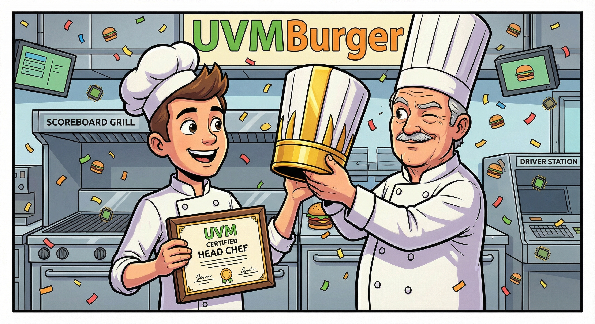

## 📋 Phase 1: The Prep Work (Fundamentals)
*Before we open the doors, we need to understand the business and prep the ingredients.*

- **Page 1: The Franchise Philosophy**
    - **Topic:** Why UVM?
    - **Analogy:** The chaotic Street Stall (Verilog) vs. The Global Franchise (UVM).
    - **Goal:** Understand standardization and reusability.

- **Page 2: The Ingredients**
    - **Topic:** SystemVerilog OOP Basics (Class, Object, Handle).
    - **Analogy:** The Recipe vs. The Burger on the plate.
    - **Goal:** Master `class`, `new()`, and `virtual interface`.

- **Page 3: The Kitchen Equipment**
    - **Topic:** The DUT (Design Under Test) & Interfaces.
    - **Analogy:** The Grill (ALU) and the Service Window (Interface).
    - **Goal:** Understanding the static (RTL) vs. dynamic (Testbench) boundary.

## 👨‍🍳 Phase 2: The Staff (UVM Components)
*Hire the team. Each person has a specific job description.*

- **Page 4: The Order Ticket**
    - **Topic:** `uvm_sequence_item` (Transaction).
    - **Analogy:** The customer's order (Burger type, sides, drinks).
    - **Goal:** Defining data fields (`rand`) and Menu Rules (`constraints`).

- **Page 5: The Waiter**
    - **Topic:** `uvm_sequencer`.
    - **Analogy:** The Traffic Cop / Waiter.
    - **Goal:** Managing the flow of orders to the kitchen (Arbitration).

- **Page 6: The Line Cook**
    - **Topic:** `uvm_driver`.
    - **Analogy:** The Chef who flips the meat.
    - **Goal:** Converting High-Level Orders (Objects) into Pin Wiggles (Signals).

- **Page 7: The Food Critic**
    - **Topic:** `uvm_monitor`.
    - **Analogy:** The Silent Observer.
    - **Goal:** Sampling signals passively and broadcasting what they see.

## 👔 Phase 3: Management & Operations (Hierarchy)
*Organize the staff into a functioning restaurant.*

- **Page 8: The Shift Manager**
    - **Topic:** `uvm_scoreboard`.
    - **Analogy:** Quality Control.
    - **Goal:** Comparing the Order Ticket (Expected) vs. The Served Burger (Actual).

- **Page 9: The Work Station**
    - **Topic:** `uvm_agent`.
    - **Analogy:** Grouping the Cook, Waiter, and Monitor into one station.
    - **Goal:** Understanding `is_active` (Active Cooking vs. Passive Watching).

- **Page 10: The Grand Opening**
    - **Topic:** `uvm_env` & `uvm_test`.
    - **Analogy:** The Restaurant Building and The Health Inspection Day.
    - **Goal:** Top-level assembly and starting the test.

- **Page 11: The Franchise Launch**
    - **Topic:** Execution Commands.
    - **Analogy:** Turning on the Open Sign.
    - **Goal:** Running the Simulators (VCS, Xcelium, Questa).

### 🏁 Certification
Upon completion of all 11 pages, you will be promoted to **Head Chef of Verification**.

