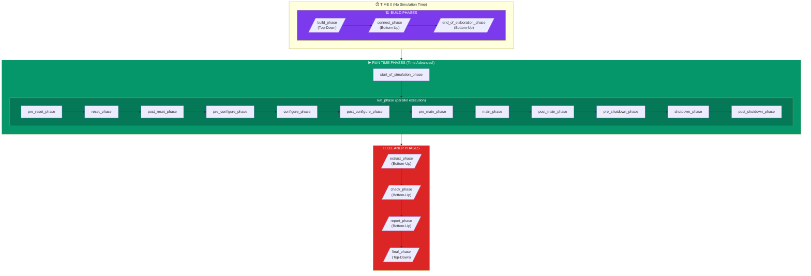

## 1. Staff vs. Food (Component vs. Object)

In UVM, there are two types of things:

### `uvm_component` (Staff - Permanent Employees)
- **Has a desk**: Fixed position in the hierarchy
- **Has a schedule**: Goes through UVM phases (build, connect, run)
- **Exists the whole shift**: Created at time 0, lives until simulation ends
- **Examples**: Driver, Monitor, Sequencer, Agent, Env, Test

```systemverilog
class burger_driver extends uvm_driver #(burger_item);
  `uvm_component_utils(burger_driver)
  // Has build_phase, connect_phase, run_phase, etc.
endclass
```

### `uvm_object` (Food - Temporary Items)
- **No hierarchy**: Just floating data packets
- **No phasing**: Created, used, destroyed
- **Short-lived**: Created on-demand, garbage collected when done
- **Examples**: Sequence Item, Sequences, Configurations

```systemverilog
class burger_item extends uvm_sequence_item;
  `uvm_object_utils(burger_item)
  // Just data - no phases
endclass
```

**Rule of Thumb:**
- If it's **infrastructure** (people, tools) → Component
- If it's **data** (orders, burgers) → Object

---

## 2. The Schedule (UVM Phasing)

The restaurant operates on a strict timeline. Everyone follows the same schedule.



### Time 0 Phases (Setup)

**1. Build Phase (Top-Down)**
- **What**: Hire staff, construct components
- **Order**: Parent creates children
- **Example**: Environment creates Agents, Agents create Drivers

```systemverilog
function void build_phase(uvm_phase phase);
  super.build_phase(phase);
  agent = burger_agent::type_id::create("agent", this);
  scoreboard = burger_scoreboard::type_id::create("scoreboard", this);
endfunction
```

**2. Connect Phase (Bottom-Up)**
- **What**: Wire things together (TLM ports)
- **Order**: Children connect first, then parents
- **Example**: Connect Monitor's port to Scoreboard's export

``` systemverilog
function void connect_phase(uvm_phase phase);
  agent.monitor.item_collected_port.connect(scoreboard.item_export);
endfunction
```

**3. End of Elaboration Phase**
- Print hierarchy, check configuration
- Last chance to verify setup before cooking starts

### Run Phase (Time Advances)

**This is the ONLY phase where simulation time moves.**

```systemverilog
task run_phase(uvm_phase phase);
  // Time ticks here!
  forever begin
    @(posedge clk);
    // Do work
  end
endtask
```

All the action happens here: driving stimulus, monitoring, checking.

### Time 0 Cleanup Phases

**Extract/Report/Final**
- Count burgers served
- Calculate coverage
- Report pass/fail statistics

---

## 3. The Keys (Config DB)

**Problem**: How does the dynamic Driver (UVM class) find the static Interface (module)?

**Answer**: The **`uvm_config_db`** - the restaurant's bulletin board.

### In the Top Module (Static World)

```systemverilog
module top;
  burger_if vif(clk);  // Physical interface
  
  initial begin
    // Post the keys on the bulletin board
    uvm_config_db#(virtual burger_if)::set(
      null,        // scope: start from top
      "*",         // wildcard: anyone can see it
      "vif",       // name: the lookup key
      vif          // value: the actual interface
    );
    
    run_test();
  end
endmodule
```

### In the Driver (Dynamic World)

```systemverilog
class burger_driver extends uvm_driver #(burger_item);
  virtual burger_if vif;
  
  function void build_phase(uvm_phase phase);
    super.build_phase(phase);
    
    // Grab the keys from the bulletin board
    if (!uvm_config_db#(virtual burger_if)::get(this, "", "vif", vif))
      `uvm_fatal("DRIVER", "No interface found! I can't see the window!")
  endfunction
endclass
```

### Config DB for Everything

You can share ANY data this way:

```systemverilog
// Set in test
uvm_config_db#(int)::set(null, "*", "num_burgers", 100);

// Get in sequence
int num_burgers;
uvm_config_db#(int)::get(this, "", "num_burgers", num_burgers);
```

**Uses:**
- Virtual interfaces (most common)
- Configuration parameters
- Test knobs and switches
- Feature enables/disables

---

## 4. The Magic Menu (The Factory)

One of UVM's most powerful features is the **Factory**. It allows you to swap components without changing the code that uses them.

### Why use `type_id::create()`?

```systemverilog
// ❌ BAD: Hard-coded. Can't change it later.
driver = new("driver", this);

// ✅ GOOD: Factory-based. Can be overridden!
driver = burger_driver::type_id::create("driver", this);
```

### The Override Trick

Imagine you want to test a "Spicy Burger" driver without rewriting the Environment.

1. **Extend the Driver**:
   ```systemverilog
   class spicy_driver extends burger_driver;
     // ... add spicy logic ...
   endclass
   ```

2. **Override in the Test**:
   ```systemverilog
   class spicy_test extends uvm_test;
     function void build_phase(uvm_phase phase);
       // Tell the factory: "Whenever someone asks for a burger_driver, give them a spicy_driver instead!"
       burger_driver::type_id::set_type_override(spicy_driver::get_type());
       
       super.build_phase(phase);
     endfunction
   endclass
   ```

**Result**: The Environment asks for a `burger_driver`, but the Factory secretly hands it a `spicy_driver`. The Environment never knows the difference!

---

## Key Takeaways

**Components vs Objects:**
- Component = Staff (hierarchy, phases, permanent)
- Object = Food (temporary, no phases)

**Phasing:**
- **Build** (Top-Down) → Hire staff
- **Connect** (Bottom-Up) → Wire ports
- **Run** (Time moves) → Do the work
- **Report** → Count the results

**Config DB:**
- The bulletin board for sharing data
- Bridges static (top module) and dynamic (UVM classes)
- Used in `build_phase` to configure components

**Factory:**
- Use `type_id::create()` to enable overrides
- Allows swapping components without changing environment code

These are the fundamental laws governing our UVM kitchen! 🍔⚖️
